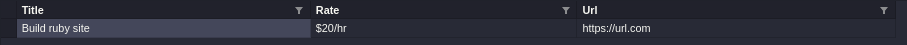
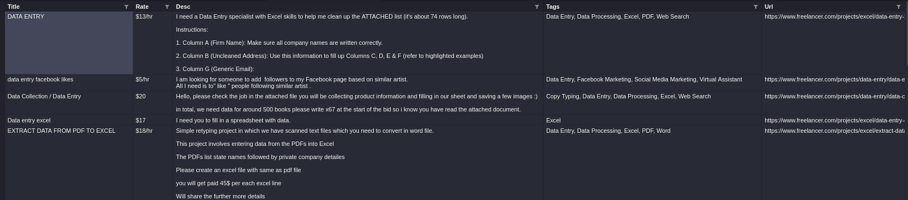
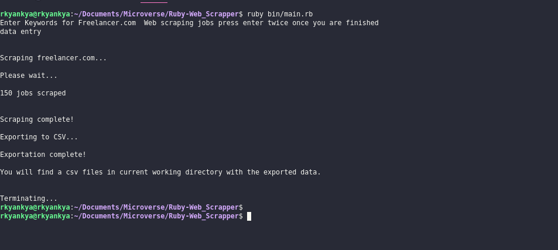
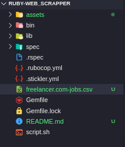

# Capstone project: Build your web scraper

### Additional description about the project and its features

## Built With

- Ruby [ruby 2.7.0p0 (2019-12-25 revision 647ee6f091) [x86_64-linux]]
- Nokogiri gem
- HTTParty gem
- Smarter_csv gem

## Project Structure

```
├── Gemfile
├── Gemfile.lock
├── script.sh
├── README.md
├── bin
│   └── main.rb
└── lib
    └── file_creater.rb
    └── freelancer.rb
└── rspec
    └── freelancer_spec.rb
    └── file_creater_spec.rb
    └── spec_helper.rb
```
## Code testing cleaning tools

- Stickler ci (Ruby in the repository)

## Build your own web scraper background
The project description in from Microverse capstone projects on the Ruby section [Link to Description:](https://www.notion.so/microverse/Build-your-own-scraper-f54eaca54d8a4d758a5f0141468127a8)

## Installation
**To run this project yo have to have this repo on your computer**
To get a local copy up and running follow these simple steps.

This web scraping tool is for freelancer.com website only: 
1) Git clone this repo and cd the to the `Ruby-Web_Scrapper` directory.
2) Run `bundle install` in command line to install Nokogiri and HTTParty Gem.
3) Run `ruby bin/main.rb`.
4) Input keywords in separate lines. Press enter key on a new line to begin the search.

### Requirements

- ruby > 2.6.x
- git > 2.x
- bundler > 2.x

### Setup

Download or clone this repository to your machine.

* To clone, go to "Clone or Download" and click on Download ZIP and extract the files to a folder in your computer

From the command line:

   `$ git clone https://https://github.com/rkyankya/Ruby-Web_Scrapper.git`

  

### Run tests
* Run `rspec`. This creates a simple sample csv file

### Summary

##### File created after running rspec


##### Sample file created after running `ruby bin/main.rb`


##### Execution process


##### File folder after created after running code



## Author
Feel free to reach out to me with any of the links below
**Kyankya Raymond**
   

 - rkyankya [Github](https://github.com/rkyankya)
 - @rkyankya [Twitter](https://twitter.com/rkyankya)
 - Kyankya Raymond [Linkedin](https://www.linkedin.com/in/kyankya-raymond-79461215a/)

## Acknowledgments

- Microverse
- Nokogiri gem
- HTTParty Parser
- Smarter_csv

## 🤝 Contributing

Contributions, issues and feature requests are welcome!

Feel free to check the [issues page](https://github.com/rkyankya/Ruby-Web_Scrapper/issues).

## Show your support

Give a ⭐️ if you like this project!


## 📝 License

This project is [MIT](LICENSE) licensed.

